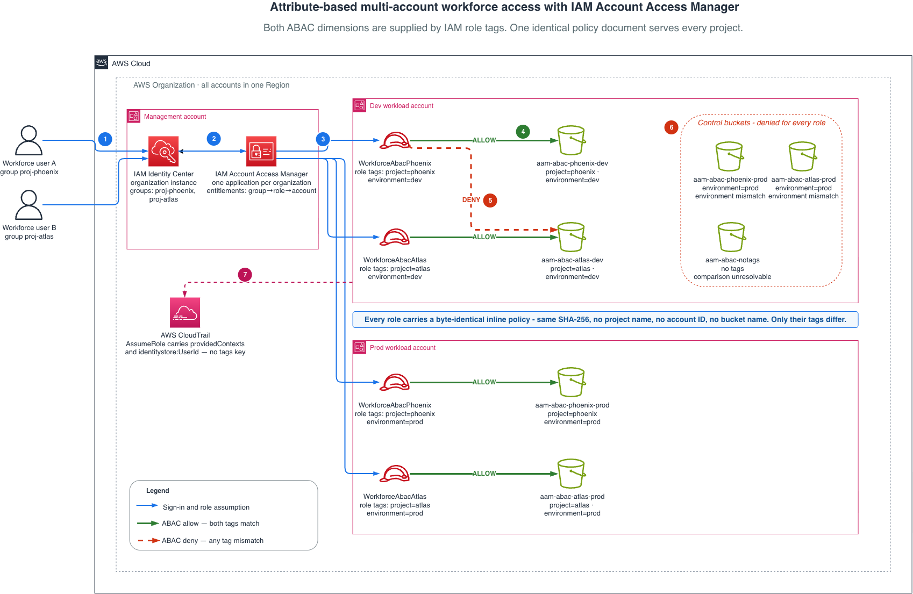

# Implement workforce access using IAM account access manager and ABAC


One IAM role per project, all sharing a **single identical policy document**. Access is decided by comparing the role's tags against the resource's tags at request time. Onboarding a new project is a tagging and entitlement operation with no policy authoring.



IAM Identity Center authenticates the user and resolves group membership. Account Access Manager maps that group to a role in a target account and assumes it with `sts:SetContext`. The role's `project` and `environment` tags surface as `aws:PrincipalTag/*`, and the policy compares them against the resource's tags at request time. Both must match, or the request is denied.

---

# Prerequisites

- An [AWS Organization](https://docs.aws.amazon.com/organizations/latest/userguide/orgs_introduction.html) with **all features** enabled. Required for IAM Identity Center and for service-level integration with Account Access Manager.
- A **management account** with IAM Identity Center set up as an **organization instance**.
- One or more **target accounts** to hold the roles and tagged resources. One is enough; two lets you show the environment dimension working across account boundaries.
- [AWS CLI](https://docs.aws.amazon.com/cli/latest/userguide/getting-started-install.html) **v2.36 or later**, with administrative credentials for each account you deploy into. Earlier versions lack the `account-access` commands and `aws login`.
- [AWS CDK v2](https://docs.aws.amazon.com/cdk/v2/guide/getting_started.html). Bootstrapping is optional — see the no-bootstrap alternative in [Step 2](#step-2-deploy-the-roles-and-buckets).
- **Node.js 18 or later**.
- A **Region** where Account Access Manager is available: AWS Commercial Regions that are enabled by default. Opt-in Regions, AWS GovCloud (US) and China Regions are not supported. Use the same Region as your Identity Center instance.

Permissions needed beyond CDK defaults: `iam:CreateRole` and `iam:CreatePolicy` with a permissions boundary in the target accounts, `s3:PutBucketAbac` on the demo buckets, and `account-access:*` plus `identitystore:CreateGroup` in the management account.

---

# Why this pattern

The usual way to give teams isolated access across many accounts is one permission set per team, per account, per environment. That model is easy to reason about, and the number of objects grows with every dimension you add.

Attribute-based access control moves the project and environment decision out of the policy and into tags. What that changes is not the number of objects — it is the number of **policy documents somebody has to write, review and keep consistent**.

| | Grows with your organization? |
| --- | --- |
| IAM roles (`PROJECTS × TARGET_ACCOUNTS`) | Yes |
| Account Access Manager entitlements (`PROJECTS × TARGET_ACCOUNTS`) | Yes |
| Identity Center groups (`PROJECTS`) | Yes |
| **ABAC policy documents to author and review** | **No — always 1** |
| **Policy documents to change when onboarding a project** | **No — always 0** |

With the defaults in `lib/config.ts` that is 2 projects × 2 accounts = **4 roles sharing 1 policy document**. At 10 projects across 20 accounts it is 200 roles sharing the same 1 policy document, byte for byte. You can verify the sharing rather than take it on trust — see [Confirm the policy is shared](#confirm-the-policy-is-shared).

The roles and entitlements are generated, so their count is a deployment detail. The policy document is the thing humans read, review and get wrong, and that is what this pattern holds constant.

## Scope: Amazon S3

This repository implements the pattern for **Amazon S3 only**. That keeps the sample small enough to read in one sitting and lets the permissions boundary stay tight.

The pattern itself is not S3-specific — `aws:ResourceTag` works with any service that supports tag-based authorization. To adapt this code to a different service you need to change two things, not one:

1. The actions in the Allow and Deny statements in `lib/abac-policy.ts`.
2. The actions in `createWorkforceBoundary()` in the same file. The boundary is a ceiling, so an action you allow but do not add there is silently withheld, which presents as an unexplained denial.

Trust policies, entitlements, role tags and the two-dimension comparison need no changes. Confirm your target service supports `aws:ResourceTag` first — see [Services that work with IAM](https://docs.aws.amazon.com/service-authorization/latest/reference/reference_policies_actions-resources-contextkeys.html).

---

# Before you deploy: edit one file

Everything you need to change lives in **`lib/config.ts`**. Nothing else requires editing.

| Value | What it is | How to find it |
| --- | --- | --- |
| `REGION` | Deployment Region | Must match your Identity Center instance. Commercial Regions enabled by default only |
| `MANAGEMENT_ACCOUNT_ID` | Organizations management account | `aws organizations describe-organization --query 'Organization.MasterAccountId' --output text` |
| `AAM_APPLICATION_ID` | Account Access Manager application ID | `aws account-access list-applications` — the part after `application/`. **Create it first, see step 1** |
| `IDENTITY_STORE_ID` | Identity Center identity store | `aws sso-admin list-instances --query 'Instances[0].IdentityStoreId' --output text` |
| `TARGET_ACCOUNTS` | Accounts holding roles and resources, each with its `environment` tag value | Your own workload account IDs |
| `PROJECTS` | Project names. One role per project per account | Your choice. Keep lowercase |
| `RESOURCE_PREFIX` | Bucket name prefix | Change only if `aam-abac-*` collides |
| `MAX_SESSION_HOURS` | Role session length | Default 4 hours. Account Access Manager permits up to 12 |

The file is commented inline with the same guidance.

---

# Which account does what

This is the part that is easy to get wrong.

| Account | What goes there | Deployed by |
| --- | --- | --- |
| **Management account** | Account Access Manager application | CLI, step 1 |
| **Management account** | Identity Center groups + entitlements | `AbacDemo-Entitlements` stack, **or** CLI |
| **Management account** | Identity Center users and their passwords | Manual, no API exists |
| **Each target account** | IAM roles, permissions boundary, tagged buckets | `AbacDemo-<environment>` stack |

The roles sit next to the resources they protect. The management account only holds the mapping of who may assume what.

---

# What gets created

## Per target account: `AbacDemo-<environment>`

**One IAM role per project**, for example with `PROJECTS = ['phoenix','atlas']` and `environment: 'dev'`:

| Role | Tags |
| --- | --- |
| `WorkforceAbacPhoenix` | `project=phoenix`, `environment=dev` |
| `WorkforceAbacAtlas` | `project=atlas`, `environment=dev` |

Both carry the **same** policy document. The tags are the only difference.

Note the role name capitalizes the project while the tag value stays lowercase. Only the tag is compared, and `StringEquals` is case-sensitive — see [Gotchas](#gotchas).

**One permissions boundary** — `WorkforceAbacBoundary-<environment>`. A hard ceiling: these roles can never act outside S3, whatever gets attached to them later.

**Buckets** — two per project, plus one control and a log destination. Shown for `environment: 'dev'`:

| Bucket | Tags | Purpose |
| --- | --- | --- |
| `<prefix>-phoenix-dev-<acct>` | project=phoenix, environment=dev | Phoenix role opens it |
| `<prefix>-atlas-dev-<acct>` | project=atlas, environment=dev | Atlas role opens it |
| `<prefix>-phoenix-prod-<acct>` | project=phoenix, **environment=prod** | **Control.** Nobody opens it |
| `<prefix>-atlas-prod-<acct>` | project=atlas, **environment=prod** | **Control.** Nobody opens it |
| `<prefix>-notags-<acct>` | none | **Control.** Nobody opens it |
| `<prefix>-logs-<acct>-<region>` | none | Server access logs |

The environment-mismatch buckets are the ones that matter. Their `project` tag matches a role exactly and they still stay locked, because the environment differs. There is one **per project**, so every project's user can run the mismatch case rather than only the first.

They sit in the **same account** on purpose. In a different account, cross-account access would fail on its own and prove nothing about the role tag.

Bucket count per account is `(2 × PROJECTS) + 2`.

## In the management account: `AbacDemo-Entitlements` (optional)

One group per project (`proj-phoenix`, `proj-atlas`) and one entitlement per group per target account.

---

# Deploy

## Step 1: create the Account Access Manager application

**Management account.** Do this first — the roles cannot be built without the application ID.

```bash
aws organizations enable-aws-service-access \
  --service-principal account-access.amazonaws.com

aws account-access create-application \
  --identity-source '{"identityCenter":{"instanceArn":"<YOUR_IDENTITY_CENTER_INSTANCE_ARN>"}}' \
  --region <REGION>

aws account-access list-applications --region <REGION>
```

Copy two values into `lib/config.ts` and note a third:

- **application ID** → `AAM_APPLICATION_ID`
- **identity store ID** → `IDENTITY_STORE_ID`
- **tenant ID** → your portal is `https://<tenantId>.account-access.<region>.app.aws`

## Step 2: deploy the roles and buckets

Once per target account, with credentials for that account.

```bash
npm install

# credentials for target account 1
npx cdk deploy AbacDemo-dev

# credentials for target account 2
npx cdk deploy AbacDemo-prod
```

If you have not used CDK in these accounts before, run `npx cdk bootstrap aws://<ACCOUNT_ID>/<REGION>` first.

**No-bootstrap alternative.** These stacks contain no Lambda code or file assets, so you can skip bootstrapping entirely:

```bash
npx cdk synth AbacDemo-dev >/dev/null
aws cloudformation deploy \
  --template-file cdk.out/AbacDemo-dev.template.json \
  --stack-name AbacDemo-dev \
  --capabilities CAPABILITY_NAMED_IAM \
  --region <REGION>
```

## Step 3: create groups and entitlements

**Management account.** Two ways. Pick one.

### Option A: CDK

```bash
npx cdk deploy AbacDemo-Entitlements
```

Deploy this **after** step 2, because the entitlements reference role ARNs that must already exist.

`cdk synth` prints `Unknown resource type 'AWS::AccountAccess::Entitlement'` and succeeds anyway. That warning is expected: aws-cdk-lib ships no L1 constructs for these types yet, so the stack declares them with a raw `CfnResource`. The CloudFormation types themselves are real and supported.

### Option B: CLI

Skip the stack and run these instead. Same result.

```bash
APP_ARN=<YOUR_APPLICATION_ARN>
STORE_ID=<YOUR_IDENTITY_STORE_ID>
REGION=<YOUR_REGION>

# --- one group per project ---
PHOENIX_GROUP=$(aws identitystore create-group \
  --identity-store-id "$STORE_ID" --region "$REGION" \
  --display-name proj-phoenix \
  --description "Workforce users for project phoenix" \
  --query GroupId --output text)

ATLAS_GROUP=$(aws identitystore create-group \
  --identity-store-id "$STORE_ID" --region "$REGION" \
  --display-name proj-atlas \
  --description "Workforce users for project atlas" \
  --query GroupId --output text)

echo "phoenix group: $PHOENIX_GROUP"
echo "atlas group:   $ATLAS_GROUP"
```

Then one entitlement per group per target account. Repeat the pair below for every account in `TARGET_ACCOUNTS`:

```bash
TARGET=<TARGET_ACCOUNT_ID>

aws account-access create-entitlement --region "$REGION" \
  --application-arn "$APP_ARN" \
  --entitlement "{
    \"principalRole\": {
      \"principal\": { \"identityCenter\": { \"groupId\": \"$PHOENIX_GROUP\" } },
      \"roleArn\": \"arn:aws:iam::${TARGET}:role/workforce/WorkforceAbacPhoenix\"
    }
  }"

aws account-access create-entitlement --region "$REGION" \
  --application-arn "$APP_ARN" \
  --entitlement "{
    \"principalRole\": {
      \"principal\": { \"identityCenter\": { \"groupId\": \"$ATLAS_GROUP\" } },
      \"roleArn\": \"arn:aws:iam::${TARGET}:role/workforce/WorkforceAbacAtlas\"
    }
  }"
```

Confirm:

```bash
aws account-access list-entitlements --region "$REGION" \
  --application-arn "$APP_ARN" \
  --filter "{\"principalRole\":{\"account\":\"$TARGET\"}}"
```

Notes on entitlements:

- **Immutable.** Changing one means delete and recreate, and the ID changes.
- **No bulk API.** At scale this is a loop. The `account-access` API throttles at 20 TPS with a hard cap of 15 outstanding async writes.
- Default quota is 20 groups per role, increasable.

## Step 4: create users (manual, no API)

Identity Center users have no CloudFormation resource type, and setting a password has no API at all. In the **IAM Identity Center console**:

1. Create two test users.
2. Add one to `proj-phoenix` and the other to `proj-atlas`.
3. For each, choose **Reset password → Generate a one-time password**. This avoids needing access to their mailbox.

This is the one step no automation can cover.

---

# Testing

Two layers. The automated matrix proves the **policy logic**. The console walkthrough proves the **propagation path**. Run both: the first cannot detect a broken identity pipeline, because it supplies the principal tags itself.

## Automated: policy matrix

`simulate-principal-policy` evaluates a deployed role without a sign-in, so it works in CI.

```bash
ROLE=arn:aws:iam::<TARGET_ACCOUNT>:role/workforce/WorkforceAbacPhoenix

aws iam simulate-principal-policy \
  --policy-source-arn "$ROLE" \
  --action-names s3:GetObject \
  --resource-arns "arn:aws:s3:::<PREFIX>-phoenix-dev-<TARGET_ACCOUNT>/file.txt" \
  --context-entries \
    "ContextKeyName=aws:PrincipalTag/project,ContextKeyValues=phoenix,ContextKeyType=string" \
    "ContextKeyName=aws:PrincipalTag/environment,ContextKeyValues=dev,ContextKeyType=string" \
    "ContextKeyName=aws:ResourceTag/project,ContextKeyValues=phoenix,ContextKeyType=string" \
    "ContextKeyName=aws:ResourceTag/environment,ContextKeyValues=dev,ContextKeyType=string" \
  --query 'EvaluationResults[0].EvalDecision'
```

Vary the two resource tags:

| `ResourceTag/project` | `ResourceTag/environment` | Expected | Why |
| --- | --- | --- | --- |
| `phoenix` | `dev` | `allowed` | Both dimensions match |
| `atlas` | `dev` | `explicitDeny` | Project mismatch — `DenyWhenProjectMismatches` fires |
| `phoenix` | `prod` | `implicitDeny` | Environment mismatch. The Deny is scoped to `project`, so this falls through to the unmatched Allow |
| *(omitted)* | *(omitted)* | `implicitDeny` | Comparison cannot resolve, and the `Null` condition keeps the Deny from firing on untagged resources |

Then drop `aws:PrincipalTag/project` to simulate a mis-tagged role. Expect `explicitDeny` from the guardrail statement.

**Two traps if you script this.**

Run it under `bash`, not `zsh`. zsh does not word-split unquoted parameter expansions, so building the `--context-entries` list in a variable collapses all four into one argument and every call fails with `ParamValidation`. Use a bash array.

Treat an API error as different from a denial. A harness that maps every non-`allowed` result to "denied" will report a fully passing matrix when in fact every call errored.

## Manual: console walkthrough

### Portal

Sign in at `https://<tenantId>.account-access.<region>.app.aws`.

Each user should see **only their own role**. A phoenix user sees `WorkforceAbacPhoenix` and no Atlas role. Seeing both means group membership is wrong; seeing none means the entitlement is wrong.

> This is also the first real test of `aws:SourceAccount`. If selecting the role produces an assumption error, check that condition: it must be the **management** account, not the account holding the role.

### The access matrix

Open the S3 console. **All buckets appear in the list**, because `s3:ListAllMyBuckets` is unconditional. Then click into each.

| Signed in as | `phoenix-dev` | `atlas-dev` | `phoenix-prod` | `atlas-prod` | `notags` |
| --- | --- | --- | --- | --- | --- |
| phoenix user | **Opens** | Denied | Denied | Denied | Denied |
| atlas user | Denied | **Opens** | Denied | Denied | Denied |

Every cell is reachable from the dev account alone. The two `-prod` columns are the environment-mismatch controls: same `project` tag as the user's role, opposite `environment`.

Use two browser profiles, or one normal and one incognito window — portal sessions are cookie-based, so the second sign-in displaces the first.

**The inversion between those two rows is the demonstration.** Same policy, opposite results, and no policy was written for either person.

### Confirm the policy is shared

```bash
for R in WorkforceAbacPhoenix WorkforceAbacAtlas; do
  aws iam get-role-policy --role-name "$R" --policy-name AbacS3Access \
    --query 'PolicyDocument' --output json \
  | python3 -c "import sys,json,hashlib;print('$R',hashlib.sha256(json.dumps(json.load(sys.stdin),sort_keys=True).encode()).hexdigest()[:16])"
done
```

Both hashes match. In the IAM console the same thing is visible: identical Permissions JSON, different Tags.

### CLI access

```bash
aws login
aws sts get-caller-identity
aws s3 ls s3://<PREFIX>-phoenix-dev-<ACCOUNT>/
aws s3 ls s3://<PREFIX>-atlas-dev-<ACCOUNT>/
```

For a phoenix user the first listing succeeds and the second returns `AccessDenied`.

`aws configure sso` and `aws sso login` do **not** work with Account Access Manager assignments; that path is specific to permission sets. Requires AWS CLI v2.36 or later.

### Boundary tests

**Mis-tagged role.** Remove a role's `project` tag and start a fresh session. Two different things happen, and the distinction matters:

- `s3:ListAllMyBuckets` **still works**, so the S3 console still shows the full bucket list. That action is granted unconditionally by `AllowNavigation`.
- `s3:ListBucket` and every object action are **denied** by `DenyDataAccessWhenProjectTagMissing`, so opening any bucket fails.

So the reader sees a normal bucket list and a denial on entry, rather than an empty console and "You don't have permissions to list buckets". That difference is deliberate: a tag problem should look like a tag problem, not like a missing permission somewhere unrelated.

```bash
aws iam untag-role --role-name WorkforceAbacPhoenix --tag-keys project
aws iam tag-role --role-name WorkforceAbacPhoenix --tags Key=project,Value=phoenix
```

**Tag-based access control disabled.** Access stops, because `aws:ResourceTag` no longer resolves bucket tags. Reversible.

```bash
aws s3api put-bucket-abac --bucket <PREFIX>-phoenix-dev-<ACCOUNT> --abac-status Status=Disabled
aws s3api put-bucket-abac --bucket <PREFIX>-phoenix-dev-<ACCOUNT> --abac-status Status=Enabled
```

**Entitlement removal.** Delete an entitlement and reload the portal: the account disappears. An established session keeps working until it expires — documented behaviour, so long-running work is not interrupted. For immediate revocation use the Identity Center revoke-user-access flow.

**Onboarding, timed.** Add a project to `PROJECTS` in `lib/config.ts`, redeploy, create a group, create one entitlement per account. Count the policies you wrote: zero.

### CloudTrail

```bash
aws cloudtrail lookup-events \
  --lookup-attributes AttributeKey=EventName,AttributeValue=AssumeRole \
  --max-results 5 --query 'Events[].CloudTrailEvent' --output text | python3 -m json.tool
```

Expect `invokedBy: account-access.amazonaws.com`, `providedContexts` with an Identity Center context assertion, and `identitystore:UserId` in `additionalEventData.sessionContext`. `roleSessionName` is the user's Identity Center user ID, not a username, because Account Access Manager logs only AWS-generated identifiers.

**Role tags do not appear in the event.** To attribute a session to a project, correlate the role ARN with that role's tags.

---

# Security posture

Machine-checked two ways. Run both before deploying, and before opening a pull request — they catch a regression here rather than in an account.

```bash
npm test                                    # 39 assertions on the security invariants
npx cdk synth >/dev/null; echo "exit=$?"    # 0 = no unsuppressed cdk-nag findings
```

`test/security.test.ts` asserts the properties that would otherwise regress
silently: the trust policy is a single conditioned statement, `aws:SourceAccount`
is the management account rather than the role's own account, every role has the
permissions boundary, all roles share one byte-identical policy document, no
statement uses a bare wildcard resource, no Allow grants a tag-mutation action,
every allowed action stays inside the boundary, and every demo bucket has
tag-based access control enabled.

The first of those is the one worth understanding. Change the assignment in
`lib/project-role.ts` to an append and the test fails with `Expected length: 1,
Received length: 2` — the extra statement being the unconditioned
`sts:AssumeRole` that makes the confused-deputy conditions bypassable.

Confirm the checks really run by breaking one control on purpose: delete `enforceSSL: true` from the demo buckets and synth again. It fails. Restore it and it passes.

| Control | Where | Well-Architected |
| --- | --- | --- |
| Permissions boundary capping roles to S3 | `WorkforceAbacBoundary-*` | SEC03 least privilege |
| Trust scoped to one AAM application | `aws:SourceAccount` + `aws:SourceArn` | SEC02 confused deputy |
| 4-hour maximum session, well under the 12-hour ceiling | `MAX_SESSION_HOURS` | SEC02 short-lived credentials |
| Fail-closed on missing role tag | `DenyDataAccessWhenProjectTagMissing` | SEC03 |
| Explicit deny on project mismatch | `DenyWhenProjectMismatches` | SEC03 defence in depth |
| Tag mutation never granted to workforce roles | No `Put*Tagging` / `TagResource` in any Allow | SEC03 |
| ARNs confined to the S3 namespace | `arn:aws:s3:::*`, not `*` | SEC03 |
| Public access blocked | `BlockPublicAccess.BLOCK_ALL` | SEC08 |
| Encryption at rest | SSE-S3 | SEC08 |
| TLS required, minimum 1.2 | `enforceSSL` + `minimumTLSVersion` | SEC09 |
| ACLs disabled | `BUCKET_OWNER_ENFORCED` | SEC03 |
| Versioning | All buckets | REL09 |
| Server access logging | Dedicated log bucket, 90-day expiry | SEC04 |
| Log delivery grant scoped | `aws:SourceAccount` on `logging.s3.amazonaws.com` | SEC02 |

**The permissions boundary is what makes this safe to delegate.** Trusting `account-access.amazonaws.com` broadly creates an escalation path: anyone able to create entitlements can hand a role to any Identity Center user. The boundary means even `AdministratorAccess` attached later cannot take these roles outside S3.

**Two documented suppressions**, both inherent to the pattern rather than shortcuts, with full justifications in `bin/app.ts`. `AwsSolutions-IAM5` for the wildcard resource ARNs, which ABAC requires because bucket names are unknown at authoring time. `AwsSolutions-S1` for the log bucket not logging to itself.

## Not covered here

**Tag governance is the control this repo cannot give you, and it matters most.** If a user can tag a resource, they can grant themselves access to it. In production, restrict tagging actions to your provisioning pipeline with an SCP, and restrict the `project` and `environment` keys specifically. Any ABAC design without this has moved the authorization decision to whoever can write tags.

**Encryption uses SSE-S3.** For regulated data use SSE-KMS with a customer managed key, for key policies and grant-level audit.

**No data perimeter SCP.** Account Access Manager already injects a session policy scoping every session to `aws:PrincipalOrgID`, so the organization boundary is covered at runtime.

---

# Clean up

Buckets are versioned, so every version must be removed before CloudFormation can delete them.

```bash
for B in $(aws s3api list-buckets \
             --query "Buckets[?starts_with(Name,'aam-abac-')].Name" --output text); do
  aws s3api delete-objects --bucket "$B" --delete "$(aws s3api list-object-versions \
    --bucket "$B" --output json --query '{Objects: Versions[].{Key:Key,VersionId:VersionId}}')" 2>/dev/null
  aws s3api delete-objects --bucket "$B" --delete "$(aws s3api list-object-versions \
    --bucket "$B" --output json --query '{Objects: DeleteMarkers[].{Key:Key,VersionId:VersionId}}')" 2>/dev/null
done

npx cdk destroy --all
```

If you deployed `AbacDemo-Entitlements`, `cdk destroy --all` already removed the groups and entitlements. If you created them by CLI, remove them explicitly.

```bash
# list, then delete each entitlement
aws account-access list-entitlements --region "$REGION" \
  --application-arn "$APP_ARN" --query 'entitlements[].entitlementId' --output text

aws account-access delete-entitlement --region "$REGION" \
  --application-arn "$APP_ARN" --entitlement-id "$ENTITLEMENT_ID"

# then the groups
aws identitystore delete-group --identity-store-id "$STORE_ID" \
  --region "$REGION" --group-id "$PHOENIX_GROUP"
aws identitystore delete-group --identity-store-id "$STORE_ID" \
  --region "$REGION" --group-id "$ATLAS_GROUP"
```

Finally delete the application. This is irreversible and removes every entitlement with it.

```bash
aws account-access delete-application --application-arn "$APP_ARN" --region "$REGION"
```

Deleting the application does **not** delete the IAM roles. They become unassumable, because nothing is left to satisfy the `aws:SourceArn` condition, but they persist until `cdk destroy` removes them.

---

# Gotchas

**Tag comparisons are case-sensitive.** `StringEquals` means `project=Phoenix` does not match `project=phoenix`. A case mismatch is a silent denial that looks like a broken policy. **Tag values are lowercase throughout this code**, and must stay that way.

**Role names capitalize the project, tag values do not.** `WorkforceAbacPhoenix` carries `project=phoenix`. The asymmetry is deliberate — the name is cosmetic, the tag is load-bearing — but it is easy to "tidy up" into `project=Phoenix` and break every comparison. `roleNameFor()` in `lib/project-role.ts` is the single source for the name, and it is shared with the entitlement stack because entitlement role ARNs are matched exactly. A divergence there fails at entitlement creation, not at deploy.

**The trust policy is one statement on purpose.** `assumedBy` on the CDK `Role` construct emits `sts:AssumeRole` with **no conditions**. If you *append* a conditioned statement instead of replacing the document, that unconditioned statement survives and the confused-deputy conditions can be bypassed for `AssumeRole`. This code overwrites the document through the L1 escape hatch.

**`aws:SourceAccount` is the management account**, not the account holding the role.

**S3 general purpose buckets need tag-based access control switched on.** Off by default, and `aws:ResourceTag` will not resolve bucket tags until you enable it. CloudFormation sets tags and `AbacStatus` together safely. By CLI, **tag first**: once ABAC is on, `PutBucketTagging` is rejected in favour of `TagResource`, and the AWS CLI does not expose an `s3api tag-resource` command. The setting itself is reversible.

**Deny statements should be scoped to data actions.** A Deny on `s3:*` also catches `s3:ListAllMyBuckets`, producing an S3 console with zero buckets and "You don't have permissions to list buckets" — which sends you hunting for a missing permission when the cause is a tag mismatch.

**The application ID is a deployment parameter.** It appears in `aws:SourceArn` on every role. Delete and recreate the application and every role must be redeployed.

**`.toLowerCase()` on a string containing a CDK token breaks it.** It rewrites the token marker so CDK stops recognising it, and bucket name validation then fails. Lowercase the literal parts only.

---

# Layout

```
lib/config.ts             EDIT THIS. All environment-specific values
lib/abac-policy.ts        Trust policy, shared ABAC policy, permissions boundary
lib/project-role.ts       createProjectRole(): one tagged role, safely wired
lib/abac-stack.ts         Per-account stack: boundary, roles, tagged buckets
lib/entitlement-stack.ts  Optional: Identity Center groups and entitlements
bin/app.ts                Stack wiring, cdk-nag, documented suppressions
test/security.test.ts     Assertions on the security invariants of the pattern
IAM-Arch.png              Architecture diagram shown above
```

---

# Mapping to the blog post

Every code block in the post has a home here.

| Blog section | Blog snippet | Here |
| --- | --- | --- |
| How ABAC works with role tags | `Allow if: PrincipalTag == ResourceTag` | `AllowAccessWhenTagsMatch` in `lib/abac-policy.ts` |
| Trust policy design | `const trustPolicy = new iam.PolicyDocument(...)` | `buildTrustPolicy()` in `lib/abac-policy.ts` |
| ABAC permissions policy design | `const abacPolicy = new iam.PolicyDocument(...)` | `buildAbacPolicy()` in `lib/abac-policy.ts` |
| Creating the roles with CDK | `function createProjectRole(...)` | `createProjectRole()` in `lib/project-role.ts` |
| Entitlement configuration | `aws account-access create-application` | Step 1 above |
| Entitlement configuration | `aws account-access create-entitlement` | Step 3 Option B above, or `lib/entitlement-stack.ts` |
| Clean up | `delete-entitlement`, `delete-application`, `cdk destroy` | Clean up above |

## Where this code deliberately differs from the printed snippets

Four changes, all of them security fixes rather than preferences. Read them before copying anything from the post into production.

**1. The trust document is assigned, not appended.** The post calls
`role.assumeRolePolicy?.addStatements(...)`. `assumedBy` has already emitted
`sts:AssumeRole` for the service principal with **no conditions**, and IAM
evaluates statements independently — so appending leaves a statement that any
caller reaching `account-access.amazonaws.com` satisfies, and
`aws:SourceAccount` / `aws:SourceArn` are bypassed for `AssumeRole` entirely.
The conditions appear in the console and enforce nothing. This code assigns the
document through the L1 escape hatch, leaving exactly one conditioned
statement. Verify on a deployed role:

```bash
aws iam get-role --role-name WorkforceAbacPhoenix \
  --query 'Role.AssumeRolePolicyDocument.Statement | length(@)'   # expect 1
```

**2. Resource ARNs are scoped to S3, not `*`.** The post uses
`resources: ['*']`. Bucket names still stay unknown at authoring time, which is
the property the pattern needs, but a bare wildcard grants the statement's
actions across every service and leans entirely on the tag condition. `arn:aws:s3:::*`
keeps the blast radius to one service if a condition is ever mis-edited.

**3. A permissions boundary is required, not optional.** It has no counterpart
in the post. Trusting `account-access.amazonaws.com` means anyone able to create
an entitlement can hand a role to any Identity Center user, so the roles need a
ceiling that survives whatever gets attached to them later.
`createProjectRole` takes it as a required argument for that reason.

**4. `aws:SourceArn` uses `StringEquals`, not `ArnLike`.** The ARN is fully
qualified with no wildcard segment, so an exact match is stricter and removes
the chance of `ArnLike` accepting a wildcard if the string is ever templated.

One further difference worth knowing: the post's "missing role tag fails
closed" section explains the outcome as an *implicit* deny. Here it is an
**explicit** deny, from `DenyDataAccessWhenProjectTagMissing`. Same result,
but `simulate-principal-policy` reports `explicitDeny` rather than
`implicitDeny`, and explicit is what you want — implicit denials are invisible
in evaluation output and can be overridden by a later Allow.

---

# Security

This is sample code intended to demonstrate a pattern. Review it against your own
requirements before running it anywhere that matters, and read
[Not covered here](#not-covered-here) first — tag governance is the control this
repository cannot give you, and it is the one that matters most.

If you discover a potential security issue in this project, please notify AWS/Amazon
Security via our [vulnerability reporting page](http://aws.amazon.com/security/vulnerability-reporting/).
Please do **not** create a public GitHub issue.

See [CONTRIBUTING](CONTRIBUTING.md) for the review expectations that apply to changes
touching the trust policy, the permissions boundary, or the ABAC policy statements.

---

# License

This library is licensed under the MIT-0 License. See the [LICENSE](LICENSE) file.
